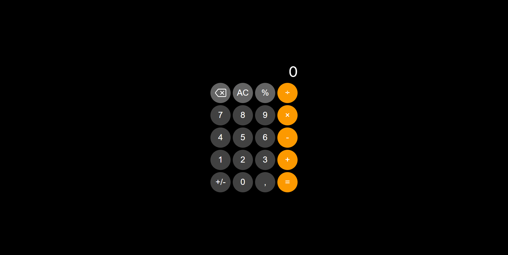

# 🧮 Calculator iOS 26

Clone da calculadora nativa do iOS, desenvolvido com **HTML**, **CSS** e **JavaScript** puro como prática de desenvolvimento front-end e versionamento com Git.

---

## 🖼️ Preview

### Calculadora


---

## 🖥️ Sobre o projeto

A **Calculator iOS 26** é uma réplica fiel da calculadora padrão do iPhone, construída do zero com tecnologias web puras. O projeto tem como foco a prática de **lógica de programação**, **estilização avançada com CSS** e **organização de código com Git**, reproduzindo a experiência visual e funcional do app nativo da Apple.

---

## ✨ Funcionalidades

- ➕ Adição, subtração, multiplicação e divisão
- 💯 Cálculo de porcentagem (`%`)
- ➕➖ Alternância de sinal (`+/-`)
- ⌫ Apagar último dígito digitado
- 🗑️ Limpar tudo (`AC`)
- 🔢 Entrada de números decimais (vírgula)
- 📟 Exibição da expressão e do resultado em tempo real

---

## 🛠️ Tecnologias utilizadas


---

## 📁 Estrutura do projeto

```
Calculator-IOS-26/
├── index.html      # Estrutura principal da calculadora
├── style.css       # Estilização inspirada no iOS
├── script.js       # Lógica de funcionamento
├── fonts/          # Fontes customizadas
└── images/         # Ícones (ex: botão de backspace)
```

---

## ⚙️ Como rodar o projeto

1. Clone o repositório:
   ```bash
   git clone https://github.com/leviroiz/Calculator-IOS-26.git
   ```

2. Acesse a pasta do projeto:
   ```bash
   cd Calculator-IOS-26
   ```

3. Abra o arquivo `index.html` diretamente no navegador.

> Nenhuma dependência ou configuração necessária — roda 100% no browser.

---

## 📚 O que aprendi

- Manipulação do DOM com JavaScript puro
- Lógica de operações matemáticas encadeadas
- Estilização de interfaces com fidelidade visual a um produto real
- Organização de commits e versionamento com Git

---

## ⚠️ Observações

- Projeto desenvolvido para fins de aprendizado
- Baseado na calculadora padrão do iOS

---

<p align="center">Desenvolvido por <a href="https://github.com/leviroiz">Carlos Levi</a> • Projeto de prática front-end 🚀</p>
